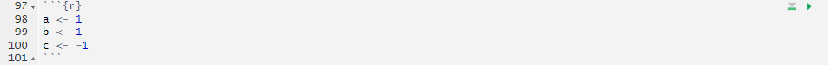

```{r write-data, include=FALSE}
library(gapminder)
library(tidyverse)
# readr::write_csv(gapminder::gapminder, here::here("data", "gapminder.csv"))
```

<!-- Fall 2025: We had some really bad saving workspace recs, and we didn't really hit on the importance of "code flow" in RMD, so I added some discussion on that, and removed a rec that you save your workspace (yikes!) -->


# Frontmatter ()
I like to use this spot to publish course announcements. Not so much for y'all, but more so I remember. If you see any announcements that don't say "" there's a good chance it's leftover from earlier course offerings. That's a reasonable indicator that you have jumped ahead... or... I forgot to edit something. 

### Participation extra credit
A careful read of our syllabus under "class participation" will show that I do give extra credit for answering questions and (mainly) sharing completed `R` coding tasks. That is, we'll walk through some examples, and when we hit a box that looks like this:

::: {.callout-note}
## Try it
Do some stuff in `R`
:::

I'll ask you to give it a go. Then, after a few minutes, I'll ask if anyone wants to share their answer. You get one of your six necessary participation credits (or extra credit at 1/5th value after the first 6). We will use Zoom **only** to share screen -- the up-arrow logo in the website header next to the Slack logo will take you to the sharing zoom. You can join whenever, I'll call on folks to share using the participant list.


### Assignment / Exercises

The Assignments page has all of our weekly lab assignments (including Week 1, due **** at 11:59pm). The assignments often have a preamble and some code that has to be used to set you up for the questions. **The questions to be completed and turned in are under "Exercises" at the very end**.


# What I assume you know {#r-basics}

If you have not yet installed R and RStudio, and if you have not yet successfully rendered the "weekly writing" template, then please make sure you do so today. Use the [resources](/resource/) page for instructions on installation of R, RStudio, and `tinytex` for rendering to latex pdfs, as is required in this class.

Pre-requisites for EC242 include PLS202, which covers the basics of using R and RStudio. Thus, we do not spend any class time on the workings of R. It is assumed you already know how to run a script, the basics of "object oriented programming" (how R refers to and manpiulates data like vectors or data.frames, etc.), and how to put together a code file that runs an analysis. 


If you are still unsure of the basic workings of `R`, I have created a review *resource* for you here: [Using R](/resource/usingR.qmd)

  

# How we use Rmarkdown

Rmarkdown lets us combine the processing and output from R code with text and headers written in plain english, which lets us *do something* in code and then *show it and discuss it* in one place.

An .Rmd (Rmarkdown document) like your [lab and weekly writing templates](/assignment/) has three parts: first, a YAML header up at the top that establishes some variables for use in rendering to PDF. Second, "code chunks" that are processed by R. And third, markdown text that is processed as normal text (via markdown langugage). You do work in code chunks, the output is included in the document, and you discuss the results in-line. When you render your document using the "knit" button, R will construct the final PDF output by running code chunks in order, and merging their output with your text. Make sure you read [using Rmarkdown](/resource/rmarkdown.html) and [using markdown](/resource/markdown.html) before you do your first weekly reading.

The header on the code chunk tells Rstudio what language to use to run the chunk (`r`), and can take some settings for displaying output. The one you want to know now is `echo=T`. When this is `TRUE` (the document's default), then knitting will include a copy of your code along with the output. Don't change this to `FALSE` or I can't see your work when grading.



Your R code goes here in these "chunks". In the upper right, you'll see a green down-pointing triangle and a green right-pointing triangle. The first one (down-pointing) runs *all of the previous code chunks up to this one* while the second (right-pointing) runs *this* code chunk.

This is very useful when you are iterating through steps to develop your code. Running a code chunk will show you the output from that code chunk, which is what will drop into your .Rmd file when you knit it. Note that you can also highlight code and use CTRL+ENTER (or CMD+ENTER for macs) to run code. 

**Code Flow**: Your script needs to contain all the steps you have taken to complete the assignment (or create your group project, etc.). For each assignment, you will have a single script that can run "from the top" and generate your results. You will be primarily working with an Rmarkdown file, so all your R progress, from loading packages and data to the final plot or output, will be in code chunks with your written answers in between.

It is important to get a grasp on this paradigm -- all code chunks are processed in order (a "flow"), and early code chunks influence later code chunks. All work has to be in the code, and it has to be in sequential order -- if you refer to an object in the 3rd code chunk from the 2nd chunk, you'll get an error, even though your local environment may have that object in it. 

When you "knit" your script, it runs from a fresh, clean, empty state, and your environment is not accessible to it. Any work you do directly into the console will not apply when you run your code from the top. You can work in the console, but it's absolutely **vital** that you then copy your work to a code chunk. This will be a source of frustration while you get used to the paradigm of **code flow**.

If you're unclear on the idea of `R`'s "workspace", see [here](/resource/usingR.qmd#workspace)


### `install.packages()`
R uses packages to add functionality. Much of R is really based on additional functionality (with "Base R" being a fairly stripped-down set of functions). As such, we'll need to install some packages. We'll state which packages are needed at the top of every unit and assignment. You need only install a package *once* on your computer, and (counter-intuitive to our discussion on code flow), you should never, ever have `install.packages()` in your recorded code (in your "code" file if using an R script, or in your code chunks in a .Rmd). If it's in your .Rmd file, when you "knit", it'll try to install the packages and will get very confused and throw an error. To install a package, you type (directly in the console) `install.packages('packageName')`. 

To **use** a package, you include (in your .Rmd, usually in the first code chunk) `library(packageName)`. 


# Data Types and Coding Concepts
For a full review of data types, see [the usingR resource](/resource/usingR.qmd). I'm going to cover some of the important, non-basic data types we'll be using.

## Functions

Once you define variables, the data analysis process can usually be described as a series of *functions* applied to the data. `R` includes several zillion predefined functions and most of the analysis pipelines we construct make extensive use of the built-in functions. But `R`'s power comes from its scalability. We have access to (nearly) infinite functions via `install.packages` and `library`. As we go through the course, we will carefully note new functions we bring to each problem. For now, though, we will stick to the basics.


In general, we need to use parentheses to evaluate a function. If you type `ls`, the function is not evaluated and instead `R` shows you the code that defines the function. If you type `ls()` the function is evaluated and, as seen above, we see objects in the workspace.

Unlike `ls`, most functions require one or more _arguments_. Below is an example of how we assign an object to the argument of the function `log`.:

```{r}
log(8)

a = 1
log(a)
```

You can find out what the function expects and what it does by reviewing the very useful manuals included in `R`.  You can get help by using the `help` function like this:
  
```{r, eval=FALSE}
help("log")
```

For most functions, we can also use this shorthand:
  
```{r, eval=FALSE}
?log
```

The help page will show you what arguments the function is expecting. For example, `log` needs `x` and `base` to run. However, some arguments are required and others are optional. You can determine which arguments are optional by noting in the help document that a default value is assigned with `=`. Defining these is optional.^[This equals sign is the reasons we assign values with `<-`; then when arguments of a function are assigned values, we don't end up with multiple equals signs. But... who cares.] For example, the base of the function `log` defaults to `base = exp(1)`---that is, `log` evaluates the natural log by default.

If you want a quick look at the arguments without opening the help system, you can type:

```{r}
args(log)
```

You can change the default values by simply assigning another object:

```{r}
log(8, base = 2)
```

Note that we have not been specifying the argument `x` as such:
```{r}
log(x = 8, base = 2)
```

The above code works, but we can save ourselves some typing: if no argument name is used, `R` assumes you are entering arguments in the order shown in the help file or by `args`. So by not using the names, it assumes the arguments are `x` followed by `base`:

```{r}
log(8,2)
```

If using the arguments' names, then we can include them in whatever order we want:
  
```{r}
log(base = 2, x = 8)
```

To specify arguments, we must use `=`, and cannot use `<-`.

There are some exceptions to the rule that functions need the parentheses to be evaluated. Among these, the most commonly used are the arithmetic and relational operators. For example:
  
```{r}
2 ^ 3
```

You can see the arithmetic operators by typing:
  
```{r, eval = FALSE}
help("+")
```

or

```{r, eval = FALSE}
?"+"
```

and the relational operators by typing:
  
```{r, eval = FALSE}
help(">")
```

or

```{r, eval = FALSE}
?">"
```

::: {.callout-tip}
## Tip

Never use `?` in your code. The help operator, `?...`, should only be used directly in the console. If you put it in your code, it'll keep opening the help, and when you include it in an Rmarkdown document, it'll behave strangely. Don't do it!

:::

### Other prebuilt objects

There are several datasets that are included for users to practice and test out functions. You can see all the available datasets by typing:
  
```{r, eval=FALSE}
data()
```

This shows you the object name for these datasets. These datasets are objects that can be used by simply typing the name. For example, if you type:
  
```{r, eval=FALSE}
co2
```

`R` will show you Mauna Loa atmospheric $CO^2$ concentration data.

Other prebuilt objects are mathematical quantities, such as the constant $\pi$ and $\infty$:
  
```{r}
pi
Inf+1
```


::: {.callout-note}
## Try it!
  
  1. Let's think about how the order of code (within or between code chunks) is important: What is the sum of the first 100 positive integers? The formula for the sum of integers $1$ through $n$ is $n(n+1)/2$. Define $n=100$ and then use `R` to compute the sum of $1$ through $100$ using the formula. What is the sum?
  
  2. Now use the same formula to compute the sum of the integers from 1 through 1,000.

  3. Look at the result of typing the following code into R:

```{r, eval=FALSE}
n <- 1000
x <- seq(1, n)
sum(x)
```

Based on the result, what do you think the functions `seq` and `sum` do?  You can use `help`.

  a. `sum` creates a list of numbers and `seq` adds them up.
  b. `seq` creates a list of numbers and `sum` adds them up.
  c. `seq` creates a random list and `sum` computes the sum of 1 through 1,000.
  d. `sum` always returns the same number.

4. In math and programming, we say that we evaluate a function when we replace the argument with a given number. So if we type `sqrt(4)`, we evaluate the `sqrt` function. In R, you can evaluate a function inside another function. The evaluations happen from the inside out.  Use one line of code to compute the log, in base 10, of the square root of 100.


5. Which of the following will always return the numeric value stored in `x`? You can try out examples and use the help system if you want.

  a. `log(10^x)`
  b. `log10(x^10)`
  c. `log(exp(x))`
  d. `exp(log(x, base = 2))`

:::


## Commenting your code

If a line of `R` code starts with the symbol `#`, it is not evaluated. We can use this to write reminders of why we wrote particular code. For example, in the script above we could add:
  
  
```{r, eval=FALSE}
## Code to compute solution to quadratic equation of the form ax^2 + bx + c
## define the variables
a <- 3
b <- 2
c <- -1

## now compute the solution
(-b + sqrt(b^2 - 4*a*c)) / (2*a)
(-b - sqrt(b^2 - 4*a*c)) / (2*a)
```


## Data frames {#data-frames}

A large proportion of data analysis challenges start with data stored in a data frame. For example, we stored the data for our motivating example in a data frame. You can access this dataset by loading the __dslabs__ library and loading the `murders` dataset using the `data` function:
  
```{r}
library(dslabs)
data(murders)
```

To see that this is in fact a data frame, we type:
  
```{r}
class(murders)
```


### Data From Packages

Woah, there -- `data(murders)` gave me an error! Well, the data, like many functions, are part of a package. Here, it's the `dslabs` package. We need to load up the package first (or install it first, as the case may be).

We can usually also refer to data in a package by referring to the package's *namespace*, which is name of the package from which the data originates. So `dslabs::murders` is an object (from the `dslabs` namespace) that can be accessed that way, too. We can use a simple line of code to create the object in our environment: `myMurders = dslabs::murders`. Now, we have a copy of the object in our environment that we can work with.


## Lists

Data frames are a special case of _lists_. We will cover lists in more detail later, but know that they are useful because you can store any combination of different types. In a data.frame, all columns have to be vectors of the same length (equal to the number of rows in the data.frame). In a list, each item can be of any length and of any type. Below is an example of a list we created for you:
  
  
```{r, echo=FALSE}
record <- list(name = "John Doe",
               student_id = 1234,
               grades = c(95, 82, 91, 97, 93),
               final_grade = "A")
```

```{r}
record
class(record)
```

As with data frames, you can extract the components of a list with the accessor `$`. In fact, data frames are a type of list.

```{r}
record$student_id
```

We can also use double square brackets (`[[`) like this:
  
```{r}
record[["student_id"]]
```

You should get used to the fact that in `R` there are often several ways to do the same thing. such as accessing entries.^[Whether you view this as a feature or a bug is a good indicator whether you'll enjoy working with `R`.]

You might also encounter lists without variable names.

```{r, echo=FALSE}
record2 <- list("John Doe",
             1234)
```

```{r}
record2
```

If a list does not have names, you cannot extract the elements with `$`, but you can still use the brackets method and instead of providing the variable name, you provide the list index, like this:

```{r}
record2[[1]]
```


We won't be using lists until later, but you might encounter one in your own exploration of `R`.  For this reason, we show you some basics here.


::: {.callout-note}
## Try it!
  
You should be familiar with the functions and concepts used in this TRY IT. If any are new to you, please see the [using R review](/resource/usingR.qmd). Consider this to be a test for retention of PLS202 concepts and methods.  

1. Install the `dslabs` package, load the package, and load the US murders dataset.

```{r}
library(dslabs)
data(murders)
```

Use the function `str` to examine the structure of the `murders` object. Which of the following best describes the variables represented in this data frame?
  
  - a) The 51 states
  - b) The murder rates for all 50 states and DC.
  - c) The state name, the abbreviation of the state name, the state's region, and the state's population and total number of murders for 2010.
  - d) `str` shows no relevant information.


2. What are the column names used by the data frame for these five variables?
  
3. Use the accessor `$` to extract the state abbreviations and assign them to the object `a`. What is the class of this object?
  
4. Now use the square brackets to extract the state abbreviations and assign them to the object `b`. Use the `identical` function to determine if `a` and `b` are the same.

5. We saw that the `region` column stores a factor. You can corroborate this by typing:
  
```{r, eval=FALSE}
class(murders$region)
```

With one line of code, use the function `levels` and `length` to determine the number of regions defined by this dataset.

6. The function `table` takes a vector and returns the frequency of each element. You can quickly see how many states are in each region by applying this function. Use this function in one line of code to create a table of states per region.
:::


## Coercion

In general, _coercion_ is an attempt by `R` to be flexible with data types. When an entry does not match the expected, some of the prebuilt `R` functions try to guess what was meant before throwing an error. This can also lead to confusion. Failing to understand _coercion_ can drive programmers crazy when attempting to code in `R` since it behaves quite differently from most other languages in this regard. Let's learn about it with some examples.

We said that vectors must be all of the same type. So if we try to combine, say, numbers and characters, you might expect an error:
  
```{r}
x <- c(1, "canada", 3)
```

But we don't get one, not even a warning! What happened? Look at `x` and its class:

```{r}
x
class(x)
```

R _coerced_ the data into characters. It guessed that because you put a character string in the vector, you meant the 1 and 3 to actually be character strings `"1"` and "`3`". The fact that not even a warning is issued is an example of how coercion can cause many unnoticed errors in `R`. 

R also offers functions to change from one type to another. For example, you can turn numbers into characters with:

```{r}
x <- 1:5
y <- as.character(x)
y
```

You can turn it back with `as.numeric`:

```{r}
as.numeric(y)
```

This function is actually quite useful since datasets that include numbers as character strings are common.

## Not availables (NA)

This "topic" seems to be wholly unappreciated and it has been our experience that students often panic when encountering an `NA`. This often happens when a function tries to coerce one type to another and encounters an impossible case. In such circumstances, `R` usually gives us a warning and turns the entry into a special value called an `NA` (for "not available").  For example:

```{r}
x <- c("1", "b", "3")
as.numeric(x)
```

R does not have any guesses for what number you want when you type `b`, so it does not try.

While coercion is a common case leading to `NA`s, you'll see them in nearly every real-world dataset. Most often, you will encounter the `NA`s as a stand-in for missing data. Again, this a common problem in real-world datasets and you need to be aware that it will come up.

We'll spend some time in Data Wrangling working on handling `NA`s. They will be the bane of your existence at one point.

## Sorting

Now that we have mastered some basic `R` knowledge (ha!), let's try to gain some insights into the safety of different states in the context of gun murders.

### `sort`

Say we want to rank the states from least to most gun murders. The function `sort` sorts a vector in increasing order. We can therefore see the largest number of gun murders by typing:

```{r}
library(dslabs)
data(murders)
sort(murders$total)
```

However, this does not give us information about which states have which murder totals. For example, we don't know which state had `r max(murders$total)`.

### `order`

The function `order` is closer to what we want. It takes a vector as input and returns the vector of indexes that sorts the input vector. This may sound confusing so let's look at a simple example. We can create a vector and sort it:

```{r}
x <- c(31, 4, 15, 92, 65)
sort(x)
```

Rather than sort the input vector, the function `order` returns the index that sorts input vector:

```{r}
index <- order(x)
print(index)
```

The second entry of `x` is the smallest, so `order(x)` starts with `2`. The next smallest is the third entry, so the second entry is `3` and so on.

To use this, we just need to place it as the index to `x`. If we look at this index, we see why it works:
```{r}
x[index]
```

This is the same output as that returned by `sort(x)`. 

How does this help us order the states by murders? First, remember that the entries of vectors you access with `$` follow the same order as the rows in the table. For example, these two vectors containing state names and abbreviations, respectively, are matched by their order:

```{r}
murders$state[1:6]
murders$abb[1:6]
```

This means we can order the state names by their total murders. We first obtain the index that orders the vectors according to murder totals and then index the state names vector:

```{r}
ind <- order(murders$total)
murders$abb[ind]
```

According to the above, California had the most murders.

If we wanted to re-order the whole data.frame based on the `murders$total` index, and **write it with the new order**:

```{r}
murders_ordered = murders[ind,]
```

This saves `murders` in a new data.frame called `murders_ordered` that is in the order defined by `ind`.

Usually when you're working with your data, you'll need to decide if you want to save as a *new* object (like `murders_ordered`), or just overwrite the original (`murders = murders[ind,]`). The answer depends on your workflow.


### `max` and `which.max`

If we are only interested in the entry with the largest value, we can use `max` for the value:

```{r}
max(murders$total)
```

and `which.max` for the index of the largest value:

```{r}
i_max <- which.max(murders$total)
murders$state[i_max]
```


For the minimum, we can use `min` and `which.min` in the same way.

Does this mean California is the most dangerous state? In an upcoming section, we argue that we should be considering rates instead of totals. Before doing that, we introduce one last order-related function: `rank`.

### `rank`

Although not as frequently used as `order` and `sort`, the function `rank` is also related to order and can be useful.
For any given vector it returns a vector with the rank of the first entry, second entry, etc., of the input vector. Here is a simple example:

```{r}
x <- c(31, 4, 15, 92, 65)
rank(x)
```

To summarize, let's look at the results of the three functions we have introduced:
  
```{r, echo=FALSE}
tmp <- data.frame(original=x, sort=sort(x), order=order(x), rank=rank(x))
if(knitr::is_html_output()){
  knitr::kable(tmp, "html") %>%
    kableExtra::kable_styling(bootstrap_options = "striped", full_width = FALSE)
} else{
  knitr::kable(tmp, "latex", booktabs = TRUE) %>%
    kableExtra::kable_styling(font_size = 8)
}
```


## Beware of recycling

Another common source of unnoticed errors in `R` is the use of _recycling_. We saw that vectors are added elementwise. So if the vectors don't match in length, it is natural to assume that we should get an error. But we don't. Notice what happens:
  
```{r, warning=TRUE}
x <- c(1,2,3)
y <- c(10, 20, 30, 40, 50, 60, 70)
x+y
```
We do get a warning, but no error. For the output, `R` has recycled the numbers in `x`. Notice the last digit of numbers in the output.


::: {.callout-note}

**TRY IT**
  
For these exercises we will use the US murders dataset. Make sure you load it prior to starting.

```{r}
library(dslabs)
data("murders")
```

1. Use the `$` operator to access the population size data and store it as the object `pop`. Then use the `sort` function to redefine `pop` so that it is sorted. Finally, use the `[` operator to report the smallest population size after sorting (it'll be the first one after sorting).

2. Now instead of finding the smallest population size, find the index of the entry with the smallest population size. Hint: use `order` instead of `sort`.

3. We can actually perform the same operation as in the previous exercise using the function `which.min`. Write one line of code that does this.

4. Now we know how small the smallest state is and we know which row represents it. Which state is it? Define a variable `states` to be the state names from the `murders` data frame. Report the name of the state with the smallest population.

5. Create a data frame using the `data.frame` function like so:
  
  
```{r}
temp <- c(35, 88, 42, 84, 81, 30)
city <- c("Beijing", "Lagos", "Paris", "Rio de Janeiro",
          "San Juan", "Toronto")
city_temps <- data.frame(name = city, temperature = temp)
```

Use the `rank` function to determine the population rank of each state from smallest population size to biggest. Save these ranks in an object called `ranks`, then create a data frame with the state name and its rank. Call the data frame `my_df`.

6. Repeat the previous exercise, but this time order `my_df` so that the states are ordered from least populous to most populous. Hint: create an object `ind` that stores the indexes needed to order the population values. Then use the bracket operator `[` to re-order each column in the data frame.

7. The `na_example` vector represents a series of counts. You can quickly examine the object using:
  
```{r}
data("na_example")
str(na_example)
```

However, when we compute the average with the function `mean`, we obtain an `NA`:
  
```{r}
mean(na_example)
```

The `is.na` function returns a logical vector that tells us which entries are `NA`. Assign this logical vector to an object called `ind` and determine how many `NA`s does `na_example` have. Note that TRUE=1 and FALSE=0 when "coerced".
:::
  
  
## Vector arithmetics
  
California had the most murders, but does this mean it is the most dangerous state? What if it just has many more people than any other state? We can quickly confirm that California indeed has the largest population:
  
```{r}
library(dslabs)
data("murders")
murders$state[which.max(murders$population)]
```

with over `r floor(max(murders$population)/10^6)` million inhabitants. It is therefore unfair to compare the totals if we are interested in learning how safe the state is. What we really should be computing is the murders per capita. The reports we describe in the motivating section used murders per 100,000 as the unit. To compute this quantity, the powerful vector arithmetic capabilities of `R` come in handy.

### Rescaling a vector

In R, arithmetic operations on vectors occur _element-wise_. For a quick example, suppose we have height in inches:
  
```{r}
inches <- c(69, 62, 66, 70, 70, 73, 67, 73, 67, 70)
```
and want to convert to centimeters. Notice what happens when we multiply `inches` by 2.54:
  
```{r}
inches * 2.54
```

In the line above, we multiplied each element by 2.54.  Similarly, if for each entry we want to compute how many inches taller or shorter than 69 inches, the average height for males, we can subtract it from every entry like this:
  
```{r}
inches - 69
```


### Two vectors

If we have two vectors of the same length, and we sum them in R, they will be added entry by entry as follows:
  
$$
  \begin{pmatrix}
a\\
b\\
c\\
d
\end{pmatrix}
+
  \begin{pmatrix}
e\\
f\\
g\\
h
\end{pmatrix}
=
  \begin{pmatrix}
a +e\\
b + f\\
c + g\\
d + h
\end{pmatrix}
$$
  
The same holds for other mathematical operations, such as `-`, `*` and `/`.

This implies that to compute the murder rates we can simply type:
  
```{r}
murder_rate <- murders$total / murders$population * 100000
```

Once we do this, we notice that California is no longer near the top of the list. In fact, we can use what we have learned to order the states by murder rate:
  
```{r}
murders$abb[order(murder_rate)]
```

Right now, the `murder_rate` object isn't in the `murders` data.frame, but we know it's the right length (why?). So we can add it:

```{r}
murders$rate = murder_rate
```

Note that now, we have two copies of the same vector of numbers -- one called `murder_rate` floatin' around in our environment, and another in our `murders` data.frame with the column name `rate`. If we re-order `murder_rate`, it won't affect anything in `murders$rate` and vice versa. 

::: {.callout-note}

## Try it!
  
1. Previously we created this data frame:
  
```{r}
temp <- c(35, 88, 42, 84, 81, 30)
city <- c("Beijing", "Lagos", "Paris", "Rio de Janeiro",
          "San Juan", "Toronto")
city_temps <- data.frame(name = city, temperature = temp)
```

Remake the data frame using the code above, but add a line that converts the temperature from Fahrenheit to Celsius. The conversion is $C = \frac{5}{9} \times (F - 32)$.

2. Write code to compute the following sum $1+1/2^2 + 1/3^2 + \dots 1/100^2$? *Hint:* thanks to Euler, we know it should be close to $\pi^2/6$.

3. Compute the per 100,000 murder rate for each state and store it in a new column called `murder_rate`. Then compute the average murder rate for the US using the function `mean`. What is the average?
:::
  
  
## Indexing
  
Indexing is a boring name for an important tool. `R` provides a powerful and convenient way of referencing specific elements of vectors. We can, for example, subset a vector based on properties of another vector. In this section, we continue working with our US murders example from before.

### Subsetting with logicals

Imagine you are moving from Italy where, according to an ABC news report, the murder rate is only 0.71 per 100,000. You would prefer to move to a state with a similar murder rate. Another powerful feature of `R` is that we can use logicals to index vectors. If we compare a vector to a single number, it actually performs the test for each entry. The following is an example related to the question above:
  
```{r}
ind <- murder_rate < 0.71
```

If we instead want to know if a value is less or equal, we can use:
  
```{r}
ind <- murder_rate <= 0.71
```

Note that we get back a logical vector with `TRUE` for each entry smaller than or equal to 0.71. To see which states these are, we can leverage the fact that vectors can be indexed with logicals.

```{r}
murders$state[ind]
```

In order to count how many are TRUE, the function `sum` returns the sum of the entries of a vector and logical vectors get _coerced_ to numeric with `TRUE` coded as 1 and `FALSE` as 0. Thus we can count the states using:

```{r}
sum(ind)
```

Since `ind` has the same length as all of the columns in `murders`, it can be used as a row index. When used as a row index, it will return all the rows *for which the condition was true*. If we use this, leaving the column index blank (for all columns):

```{r}
murders[ind,]
```

### Logical operators

Suppose we like the mountains and we want to move to a safe state in the western region of the country. We want the murder rate to be at most 1. In this case, we want two different things to be true. Here we can use the logical operator _and_, which in `R` is represented with `&`. This operation results in `TRUE` only when both logicals are `TRUE`. To see this, consider this example:
  
```{r}
TRUE & TRUE
TRUE & FALSE
FALSE & FALSE
```

For our example, we can form two logicals:
  
```{r}
west <- murders$region == "West"
safe <- murder_rate <= 1
```

and we can use the `&`  to get a vector of logicals that tells us which states satisfy both conditions:
  
```{r}
ind <- safe & west
murders$state[ind]
```

### `which`

Suppose we want to look up California's murder rate. For this type of operation, it is convenient to convert vectors of logicals into indexes instead of keeping long vectors of logicals. The function `which` tells us which entries of a logical vector are TRUE. So we can type:

```{r}
ind <- which(murders$state == "California")
murders$rate[ind]
```


### `%in%`


If rather than an index we want a logical that tells us whether or not each element of a first vector is in a second, we can use the function `%in%`. Let's imagine you are not sure if Boston, Dakota, and Washington are states. You can find out like this:
  
```{r}
c("Boston", "Dakota", "Washington") %in% murders$state
```

Note that we will be using `%in%` often throughout the course


::: {.callout-note}
## Try it!
  
Start by loading the library and data.
```{r}
library(dslabs)
data(murders)
```
Note that every time you run this, you replace `murder` in your environment. So if you had created the `murders$rate` column, it's gone. But if you created the free-floating object `murder_rate`, that still exists (but can be overwritten).

1. Compute the per 100,000 murder rate for each state and store it in an object called `murder_rate`. Then use logical operators to create a logical vector named `low` that tells us which entries of `murder_rate` are lower than 1.

2. Now use the results from the previous exercise and the function `which` to determine the indices of `murder_rate` associated with values lower than 1.

3. Use the results from the previous exercise to report the names of the states with murder rates lower than 1.

4. Now extend the code from exercises 2 and 3 to report the states in the Northeast with murder rates lower than 1. Hint: use the previously defined logical vector `low` and the logical operator `&`.

5. In a previous exercise we computed the murder rate for each state and the average of these numbers. How many states are below the average?
  
6. Use the match function to identify the states with abbreviations AK, MI, and IA. Hint: start by defining an index of the entries of `murders$abb` that match the three abbreviations, then use the `[` operator to extract the states.

7. Use the `%in%` operator to create a logical vector that answers the question: which of the following are actual abbreviations: MA, ME, MI, MO, MU?
  
8. Extend the code you used in exercise 7 to report the one entry that is **not** an actual abbreviation. Hint: use the `!` operator, which turns `FALSE` into `TRUE` and vice versa, then `which` to obtain an index.

:::


::: {.callout-tip}
## Ope!
If we get all the way to the end of Week 01b, we will likely start on Week 02a -- the tidyverse. I'm re-arranging the content and still fine-tuning length.
:::

## Further help with `R`
  If you are not comfortable with `R`, the earlier you seek out help, the better. Quietly letting the course pass by you because you don't know how to fix an error will do nobody any good. Attend 's office hours [see Syllabus](/syllabus.html) for times. Also, join the course Slack (see the front page of our course website for a link) and post questions there.

Finally, there are also primers on [Rstudio.cloud](https://rstudio.cloud/learn/primers) that can be useful. There are many ways we can help you get used to `R`, but only if you reach out.

